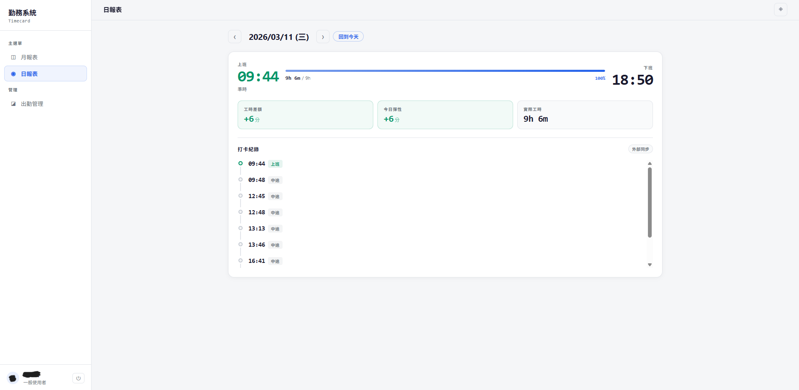
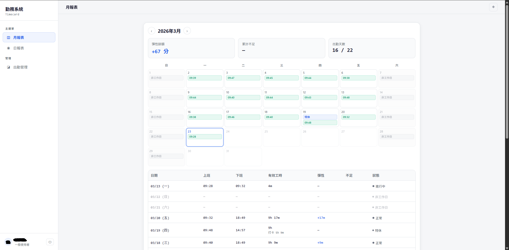

# Timecard

上班打卡、下班打卡，然後呢？**Timecard** 幫你把中間那段算清楚。

自用的工時管理系統 — 自動計算每日實際工時、追蹤彈性時數（flex time）餘額、產出月報表。適合採用彈性工時制度、需要自主管理出勤紀錄的人。

## 畫面

| 日報表 | 月報表 |
|--------|--------|
|  |  |

## 功能

- **打卡紀錄同步** — 支援外部系統匯入打卡資料，自動拆分多段工作 session
- **彈性工時計算** — 每日標準工時 9 小時，超時/不足自動累計至月彈性餘額（±55 分鐘/日上限）
- **出缺勤管理** — 手動登記請假、加班、補班等調整
- **月報表** — 日曆視圖 + 明細表，一眼掌握整月出勤狀態
- **管理員匯出** — CSV 匯出，方便後續處理

## Tech Stack

| 層級 | 技術 |
|------|------|
| Backend | .NET 10 · ASP.NET Core Minimal APIs |
| Frontend | Vue 3 · Vite |
| Database | PostgreSQL · EF Core (Npgsql) |
| Deploy | Docker Compose |

## 快速開始

### Docker（推薦）

```bash
cp .env.example .env        # 填入環境變數（見 docs/deployment.md）
docker compose up -d        # 首次啟動，自動 build + 跑 migration
```

### 本機開發

需求：.NET 10 SDK、Node.js 22+、PostgreSQL

```bash
# 後端
dotnet run --project src/Timecard.Api/Timecard.Api.csproj

# 前端（dev server，自動 proxy /api → backend）
cd client && npm install && npm run dev
```

資料庫連線字串透過 `ConnectionStrings:Timecard` 設定（`appsettings.json` 或 `dotnet user-secrets`）。

## 文件

- [部署與設定](docs/deployment.md) — Docker 部署、環境變數、發布流程
- [API 參考](docs/api.md) — 端點快速測試

## License

MIT
